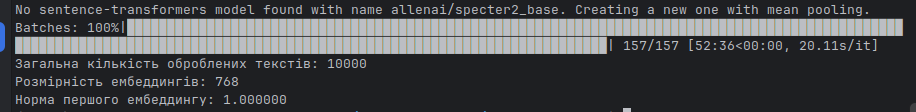
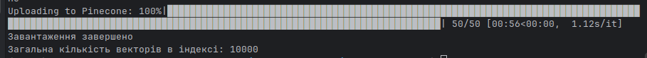

# Запуск скриптів

Усі скрипти необхідно запускати як Python-модулі з кореневої директорії проєкту. Це забезпечує коректну роботу абсолютних імпортів (`helpers`, `config` тощо).
1. Завантаження і підготовка датасету
```bash
kaggle datasets download -d Cornell-University/arxiv
unzip arxiv.zip
python -m scripts.01_prepare_data
```
2. Отримання ембеддингів
```bash
python -m scripts.02_embed
```
3. Завантаження даних і метадані
```bash
python -m scripts.03_load_to_pinecone
```
4. Пошукові запити
```bash
python -m scripts.04_search
```
5. Chunking
```bash
python -m scripts.05_chunking
```
6. Гібридний пошук
```bash
python -m scripts.06_hybrid_search
```
***
### Відповіді на питання
# Частина 1 — Підготовка даних і вибір інструментів
***
### 1. Чим Pinecone відрізняється від Qdrant і Chroma за моделлю розгортання, ліцензією і продуктивністю? У якому сценарії ви б обрали кожен із них?

|                    | Pinecone                                                          | Qdrant                                                                              | Chroma                                                                |
|--------------------|-------------------------------------------------------------------|-------------------------------------------------------------------------------------|-----------------------------------------------------------------------|
| Модель розгортання | Повністю керований хмарний сервіс (SaaS)                          | Self-hosted або Qdrant Cloud                                                        | Локально, self-hosted або Chroma Cloud                                |
| Ліцензія           | Хмарний сервіс із закритим вихідним кодом                         | Apache 2.0, open source                                                             | Apache 2.0, open source                                               |
| Продуктивність     | Не потребує розгортання інфраструктури, автоматичне масштабування | Дуже висока продуктивність та низьке споживання ресурсів завдяки реалізації на Rust | Хороша для локальної розробки, прототипів та локальних RAG-пайплайнів |

#### У яких сценаріях обрати кожне рішення?
#### Pinecone
- великі production-системи;
- SaaS із мільйонами документів;
- коли важливі SLA, автоматичне масштабування та мінімальні DevOps-витрати;
- коли потрібен швидкий MVP або proof-of-concept.

#### Qdrant
- коли дані не можуть покидати вашу інфраструктуру (compliance, безпека);
- розгортання у власній інфраструктурі або приватній хмарі;
- гібридний пошук з коробки
- системи, де потрібна висока продуктивність і складна фільтрація за метаданими.

#### Chroma
- навчальні проєкти;
- локальна розробка RAG-додатків;
- швидке прототипування;
- невеликі застосунки або проекти, де немає потреби в горизонтальному масштабуванні.
***
### 2. Чому для задачі пошуку по науковим текстам обрана модель specter2_base, а не універсальна all-MiniLM-L6-v2? Знайдіть картку моделі на HuggingFace і процитуйте, для яких задач вона навчена.

Для задачі пошуку по наукових текстах була обрана модель specter2_base, оскільки вона спеціально навчалася на корпусі наукових публікацій.
Згідно з карткою моделі на HuggingFace: 

 «SPECTER2 була навчена на понад 6 мільйонах трійок цитувань наукових статей (доступні за [посиланням](https://huggingface.co/datasets/allenai/scirepeval/viewer/cite_prediction_new/evaluation)). Після цього модель була додатково донавчена за допомогою спеціалізованих адаптерних модулів для кожного формату задач на всіх навчальних завданнях набору SciRepEval. 

Формати задач, на яких навчалася модель:

* класифікація (Classification);
* регресія (Regression);
* пошук за близькістю або пошук схожих документів (Proximity / Retrieval);
* пошук за довільним текстовим запитом (Adhoc Search).»
***

### 3. Що написано у картці моделі про рекомендовану метрику схожості? Чому це важливо при створенні індексу?
У картці моделі `allenai/specter2_base` немає явної рекомендації щодо конкретної метрики схожості: cosine, dot product або euclidean.

Однак у цьому проєкті ембеддинги генеруються з параметром normalize_embeddings=True, тобто всі вектори мають одиничну довжину. Для таких векторів cosine similarity і dot product дають однакове ранжування результатів.

Тому для індексу Pinecone було обрано **metric="cosine"** як природний і поширений варіант для семантичного пошуку.

***
### 4. Поясніть, чому при використанні нормалізованих ембеддингів (одиничної довжини) косинусна схожість (cosine similarity) еквівалентна скалярному добутку (dot product)?

Косинусна схожість між двома векторами обчислюється як їхній скалярний добуток, поділений на добуток довжин цих векторів:

$$
\text{cosine_similarity}(A, B) = \frac{A \cdot B}{||A|| \cdot ||B||}
$$

Якщо ембеддинги попередньо нормалізовані до одиничної довжини, тобто (||A|| = ||B|| = 1), знаменник формули дорівнює 1, а отже косинусна схожість стає рівною звичайному скалярному добутку:

$$
\text{cosine_similarity}(A, B) = A \cdot B
$$

Тому для нормалізованих ембеддингів використання **Dot Product дає ті самі результати, що і Cosine Similarity**.

Отримання ембеддингів


Завантаження даних в Pinecone

***

# Частина 3 — Пошукові запити
***

### 1. Чи збігаються топ-5 для cosine і dot product і чому?
Оскільки ембеддинги нормалізовані, cosine similarity і dot product зазвичай дають однаковий або майже однаковий топ результатів.

### 2. Чи відрізняються результати для L2 і чому?
Для цього запиту результати для L2-distance повністю збіглися з результатами cosine similarity та dot product.

Оскільки для нормалізованих ембеддингів мінімізувати L2-distance еквівалентно максимізації dot product і cosine similarity. Тому ранжування результатів виходить однаковим: для L2 ми шукаємо найменшу відстань, а для cosine та dot product — найбільшу схожість.

### 3. Що сталося б, якби ембеддинги не були нормалізовані?
Якби ембеддинги не були нормалізовані, результати для cosine similarity, dot product і L2-distance могли б суттєво відрізнятися.

- Cosine similarity порівнює лише напрямок векторів і не залежить від їхньої довжини.
- Dot product враховує і напрямок, і довжину векторів, тому документи з більшими за модулем ембеддингами могли б отримувати вищий рейтинг навіть при меншій семантичній схожості.
- L2-distance також залежить від довжини векторів, тому ранжування могло б бути зовсім іншим.

Повний лог виконання запитів: [04.log](media/04.log)
***

# Частина 4 — Chunking
***

### 1. Яка стратегія дає більш осмислені чанки?
Більш осмислені чанки зазвичай дає семантична стратегія чанкування, оскільки вона намагається розділяти текст по природних межах: реченнях, абзацах або завершених думках.

Фіксоване чанкування просто ділить текст на однакові за розміром частини, тому один логічний фрагмент може бути розбитий між двома чанками або, навпаки, в одному чанку можуть опинитися не пов'язані між собою частини тексту.

### 2. Чи є випадки розрізаних речень і як це впливає на ембеддинги?
Так, при використанні фіксованого чанкування можуть виникати випадки, коли речення розрізаються між двома чанками. У результаті частина контексту потрапляє в один чанк, а продовження — в інший.

Це може негативно впливати на якість ембеддингів, оскільки модель отримує неповну або обірвану думку і формує менш точне векторне представлення тексту.

Семантичне чанкування зазвичай уникає цієї проблеми, оскільки намагається зберігати речення та логічно пов'язані фрагменти тексту в межах одного чанка.
### 3. Як розмір overlap впливає на кількість чанків і покриття тексту?
Чим більший overlap, тим більше тексту дублюється між сусідніми чанками. Це збільшує кількість чанків, але допомагає зберегти контекст на межах між ними.

Малий або відсутній overlap зменшує кількість чанків і економить місце в індексі, але підвищує ризик втрати важливої інформації, якщо речення або логічна думка опиняються на межі двох чанків.

Таким чином, overlap є компромісом між розміром індексу та якістю покриття тексту і пошуку.

Повний лог виконання запитів: [05.log](media/05.log)
***
                            
# Частина 5 — Гібридний пошук
***
### 1. Який метод дав кращий результат і чому?
Найкращий результат дав гібридний пошук з RRF, тому що він поєднує переваги двох різних підходів:

- **BM25** добре знаходить документи за точним збігом ключових слів. Наприклад, якщо в запиті є BERT, fine-tuning або Yann LeCun, BM25 знаходить статті, де ці слова прямо зустрічаються в назві або abstract.

- **Векторний пошук** краще працює із семантично схожими запитами, навіть якщо точні слова не збігаються. Наприклад, за запитом `making computers understand human emotions from text` знаходиться стаття `On the Development of Text Input Method - Lessons Learned`.

**Гібридний пошук з RRF** поєднує результати BM25 і векторного пошуку та надає більшу перевагу документам, які добре ранжуються в обох списках. Тому він зазвичай дає більш стабільний і релевантний результат: BM25 додає точність за ключовими словами, а векторний пошук — розуміння змісту запиту.

### 2. Чи є документи в топ-5 гібридного пошуку, яких немає в топ-5 окремих методів, і чому?
Так, у топ-5 гібридного пошуку можуть з'явитися документи, яких не було в топ-5 BM25 або векторного пошуку окремо. Це відбувається тому, що RRF об'єднує результати обох методів і підвищує документи, які отримали хороші позиції в обох списках.

Наприклад запит `Yann LeCun convolutional networks`
- У BM25 першими йдуть документи, які містять точні збіги з ключовими словами запиту, зокрема зі словом "convolutional", тому результати про convolutional codes отримали найвищі позиції.
- У векторному пошуку на перших місцях опинилися документи, які модель вважає семантично близькими до теми нейронних мереж та машинного навчання.
- У hybrid RRF порядок результатів змінився: на перше місце вийшов документ _Optimization in Gradient Networks_, який мав хороші позиції в обох списках (4-е місце в BM25), а не був лідером лише одного методу. Інші результати також є комбінацією документів із BM25 та векторного пошуку.

Гібридний пошук не просто об'єднує результати двох методів, а переранжовує їх, підвищуючи документи, які отримали хороші позиції одночасно в BM25 і у векторному пошуку. Це дозволяє отримати більш збалансований і стійкий рейтинг документів.

### 3. Як зміна параметра k в RRF впливає на видачу (наприклад, k=60 vs k=1)?
Параметр k в RRF визначає, наскільки сильно позиція документа впливає на його фінальний бал.

Константа k керує тим, наскільки швидко зменшується вага документа зі збільшенням його рангу:

- Малий k (наприклад, k=1) — різниця між першими позиціями дуже велика, тому фактично домінують документи, які займають найвищі місця в окремих методах.
- Великий k (наприклад, k=60) — різниця між сусідніми рангами стає дуже малою. У цьому випадку враховується ширший набір документів із обох списків, а перевагу отримують документи, які стабільно присутні в обох ранжуваннях.

Отже, k=1 сильніше підсилює лідерів окремих методів, тоді як k=60 забезпечує більш збалансовану та стабільну видачу результатів. Саме тому значення 60 є найпоширенішим стандартним вибором для RRF.

Повний лог виконання запитів: [06.log](media/06.log)
***
# Частина 6 — Аналіз і висновки
***

### 1. Семантичний пошук vs BM25. Наведіть конкретні приклади запитів із вашої роботи, де кожен метод виграв. Сформулюйте загальне правило: для яких типів запитів варто надати перевагу кожному з них?

BM25 краще працює для запитів із точними термінами, назвами моделей, іменами авторів або специфічною термінологією, коли важливий саме збіг слів у документі.
Семантичний пошук краще працює для описових запитів природною мовою, коли користувач пояснює ідею або задачу, а не використовує конкретні ключові слова.

У проведених експериментах:

Для запиту "BERT fine-tuning" кращі результати показав BM25, оскільки він зміг знайти документи з точним збігом фрази fine tuning.
Для запиту "Yann LeCun convolutional networks" більш корисними виявилися результати семантичного пошуку, оскільки він знаходив роботи, пов'язані з нейронними мережами загалом, тоді як BM25 орієнтувався переважно на слово convolutional і повертав документи про convolutional codes.
Для запиту "making computers understand human emotions from text" перевагу мав семантичний пошук, оскільки він працював із загальним змістом запиту і знаходив роботи, пов'язані з думками, увагою та поведінкою людей, тоді як BM25 шукав окремі слова на кшталт text або human.

## Порівняння ТОП-5 запитів

| Запит                                                    | BM25                                                                                                                                                                                                                                                | Vector Search                                                                                                                                                                                                                                        | Hybrid RRF                                                                                                                                                                                                                                                        |
|----------------------------------------------------------| ---------------------------------------------------------------------------------------------------------------------------------------------------------------------------------------------------------------------------------------------------------- | --------------------------------------------------------------------------------------------------------------------------------------------------------------------------------------------------------------------------------------------------------- | ---------------------------------------------------------------------------------------------------------------------------------------------------------------------------------------------------------------------------------------------------------------------------- |
| **BERT fine-tuning**                                     | 1. A New Measure of Fine Tuning<br/>2. The NMSSM Solution to the Fine-Tuning Problem<br>3. Fine-Tuning in Brane-antibrane Inflation<br>4. Natural SUSY Dark Matter<br>5. Stability and hierarchy problems...                                                 | 1. Misere quotients for impartial games<br>2. Introduction to Phase Transitions...<br>3. Abstract Convexity and Cone-Vexing Abstractions<br>4. Differential Operations and Gateaux Derivative<br>5. Experimental local realism tests...                   | 1. A New Measure of Fine Tuning<br>2. Misere quotients for impartial games<br>3. The NMSSM Solution to the Fine-Tuning Problem<br>4. Introduction to Phase Transitions...<br>5. Fine-Tuning in Brane-antibrane Inflation                                                     |
| **Yann LeCun convolutional networks**                    | 1. On Punctured Pragmatic Space-Time Codes<br>2. Trellis-Coded Quantization...<br>3. Response of degree-correlated scale-free networks<br>4. Optimization in Gradient Networks<br>5. Simulation of Robustness against Lesions...                           | 1. Multilayer Perceptron with Functional Inputs<br>2. The Netsukuku network topology<br>3. Differential Operations and Gateaux Derivative<br>4. Modeling the field of laser welding melt pool by RBFNN<br>5. Adaptive classification of temporal signals... | 1. Optimization in Gradient Networks<br>2. On Punctured Pragmatic Space-Time Codes<br>3. Multilayer Perceptron with Functional Inputs<br>4. Trellis-Coded Quantization...<br>5. The Netsukuku network topology                                                               |
| **making computers understand human emotions from text** | 1. On the Development of Text Input Method<br>2. An Automated Evaluation Metric for Chinese Text Entry<br>3. Towards Understanding the Origin of Genetic Languages<br>4. Detecting anchoring in financial markets<br>5. Maximal C*-algebras | 1. Opinion Dynamics and Sociophysics<br>2. On the Development of Text Input Method<br>3. Extracting the hierarchical organization of complex systems<br>4. Novelty and Collective Attention<br>5. Narratives within immersive technologies                | 1. On the Development of Text Input Method<br>2. Opinion Dynamics and Sociophysics<br>3. An Automated Evaluation Metric for Chinese Text Entry<br>4. Towards Understanding the Origin of Genetic Languages<br>5. Extracting the hierarchical organization of complex systems |


### 2. Вплив розміру чанка. Що відбувається з якістю пошуку, якщо чанк занадто маленький (10–15 слів)? Якщо занадто великий (500+ слів)? Чи є оптимальний розмір або він залежить від задачі?

Якщо чанк занадто маленький (наприклад, 10–15 слів), він містить недостатньо контексту для побудови якісного ембеддингу. У результаті семантичний пошук гірше розуміє зміст документа, а релевантна інформація може бути розділена між кількома чанками і не потрапити до результатів пошуку.

Якщо чанк занадто великий (наприклад, 500+ слів), у ньому може змішуватися кілька різних тем. Через це ембеддинг стає більш "усередненим", а пошук повертає великі фрагменти тексту, лише частина яких справді стосується запиту.

Тому існує компроміс між кількістю контексту та точністю пошуку. Для більшості RAG-систем добре працюють чанки розміром приблизно 100–300 слів із невеликим перекриттям між сусідніми чанками.

Універсального оптимального розміру чанка не існує — він залежить від задачі:
- для систем Question Answering і пошуку конкретних фактів найкраще працюють невеликі семантичні чанки розміром 1–3 речення (приблизно 50–75 слів);
- для коротких анотацій зазвичай достатньо 80–120 слів;
- для задач сумаризації краще підходять чанки на рівні абзаців розміром 150–250 слів;
- для довгих PDF-документів часто використовують більші чанки з overlap, щоб не втрачати контекст між сусідніми фрагментами.

### 3. Невідповідна метрика. Що сталося б, якби ми створили індекс Pinecone з метрикою euclidean (L2), але використовували модель, яка повертає нормалізовані вектори? Обґрунтуйте відповідь математично: виведіть зв’язок між L2 і cosine для одиничних векторів.
Якби ми створили індекс Pinecone з метрикою euclidean (L2 distance), але використовували нормалізовані embeddings (normalize_embeddings=True), якість пошуку практично не змінилася б.

Для двох одиничних векторів a і b виконується співвідношення:

||a - b||² = 2 - 2 · cos(a, b)

Тобто чим більша косинусна схожість, тим менша L2-відстань. Це означає, що L2 і cosine дають однакове ранжування для нормалізованих векторів.

Тому використання euclidean у цьому випадку не є помилкою, але на практиці для нормалізованих embeddings зазвичай використовують cosine або dotproduct, оскільки вони краще відповідають поняттю семантичної схожості та можуть бути ефективнішими обчислювально.

Проблеми виникають лише для ненормалізованих векторів, коли різні метрики можуть давати різне ранжування документів.


### 4. Обмеження Pinecone Starter. З якими обмеженнями безкоштовного тіру ви зіткнулися (або могли б зіткнутися)? Як би ви вирішили задачу, якби датасет був не 10000, а 10 мільйонів статей?
Безкоштовний тариф Pinecone Starter має обмеження на кількість індексів, обсяг сховища і продуктивність. Для нашого завдання цього було достатньо, але при роботі з кількома індексами для різних стратегій chunking можна було б швидко впертися в ліміти.

Якби датасет містив 10 мільйонів статей (а після chunking — десятки мільйонів векторів), знадобилися б такі зміни:

- перехід на платний тариф Pinecone або використання масштабованих рішень на кшталт Qdrant чи Milvus;
- використання шардування (sharding) для розподілу векторів між кількома вузлами;
- зберігання у векторній базі лише векторів і мінімальних метаданих, а повних текстів — в окремому сховищі;
- використання namespace або фільтрів за роками чи категоріями для зменшення простору пошуку;
- застосовувати стиснення векторів або зменшення розмірності ембеддингів для економії пам'яті;

Іншими словами, перехід від 10 тисяч до 10 мільйонів документів потребує переходу від навчальної архітектури до повноцінного промислового рішення.


